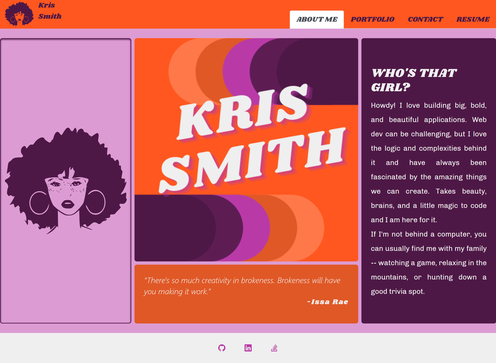

# kris-react-portfolio

  ## Description
  This purpose of this project was to create a portfolio displaying my web development skills to date. 
  
  Application loads once with a landing page that will uses ```useEffect``` & ```setTimeout``` to automatically transition to the "about me" page when site first renders. Users can visit "about me", "portfolio", "contact", and "resume" pages without reloading site.
  
  
  The project uses React, Tailwind, Bootstrap, and Node.js.


## Deployed application
 You can view my portfolio by visiting [link to deployed application here.](https://budget-tracks789.herokuapp.com/)



  ## Questions
  Contact the developer with any questions!

[KrisSmith7](https://github.com/krissmith7)